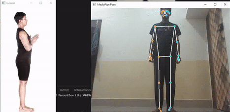

# Virtual Yoga Instructor



* [Description](#description)
* [Features](#features)
* [Setup](#setup)

## Description:
The application helps in finding the correctness of a yoga posture by comparing it with an expert's yoga pose. 

## Features:
* **When the desired pose is achieved by the yoga practitioner it beeps and shows next pose.**
* **Used affine Transformation to match two skeletons.**
* **MediaPipe was used to get stream of images of practitioner and return the response live.**

## Setup:

## Only for Windows:
1. Install chocolatey from [here](https://chocolatey.org/install) or run the below command on powershell.
```
$ Set-ExecutionPolicy Bypass -Scope Process -Force; [System.Net.ServicePointManager]::SecurityProtocol = [System.Net.ServicePointManager]::SecurityProtocol -bor 3072; iex ((New-Object System.Net.WebClient).DownloadString('https://community.chocolatey.org/install.ps1'))
```
2. Then Install choco
```
$ choco install make
```
3. Clone the repository:
```
$ git clone https://github.com/Praveendwivedi/HackFit.git 
$ cd HackFit
$ make
```
  - for Windows:
  ```
    $ Set-ExecutionPolicy -ExecutionPolicy Unrestricted -Scope CurrentUser
    $ . HFenv\Scripts\activate
  ```
  - for linux:
  ```
  . ./HFenv/bin/activate
  ```
  - finally:
  ```
  $ make run
  ```  

# [Checkout this video](https://youtu.be/m2hI3iNktMk)!!
